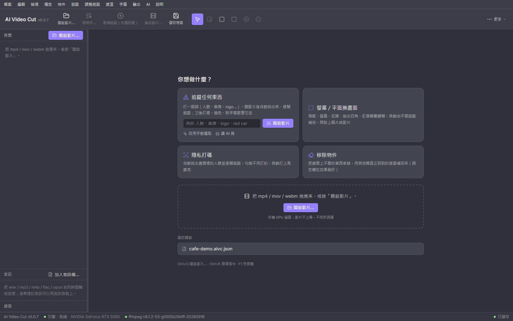
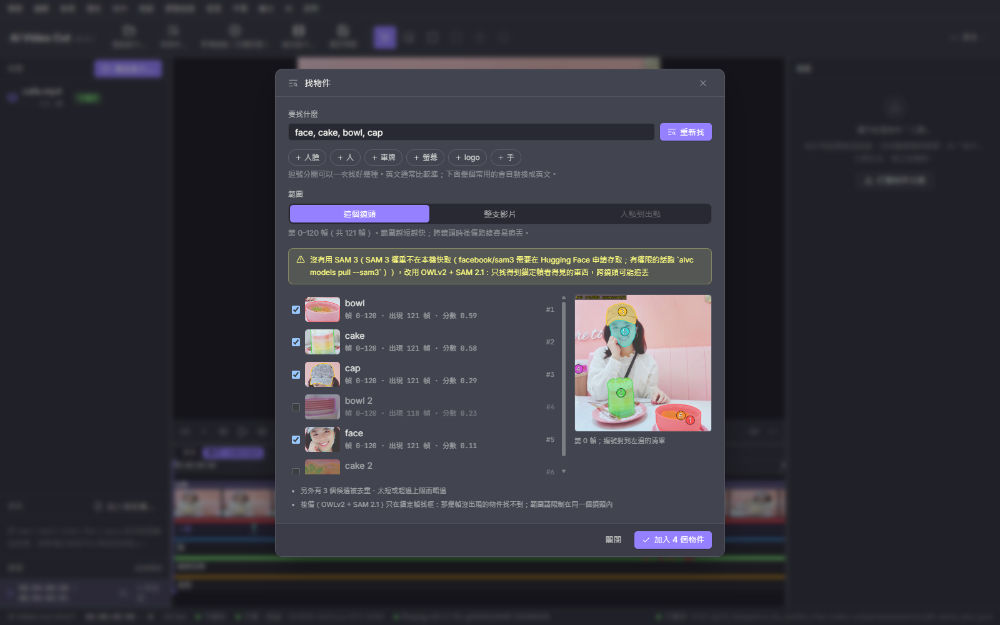
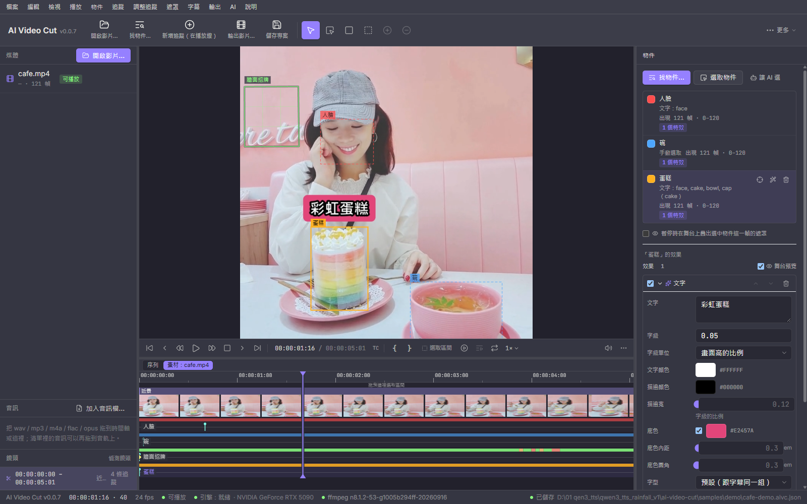
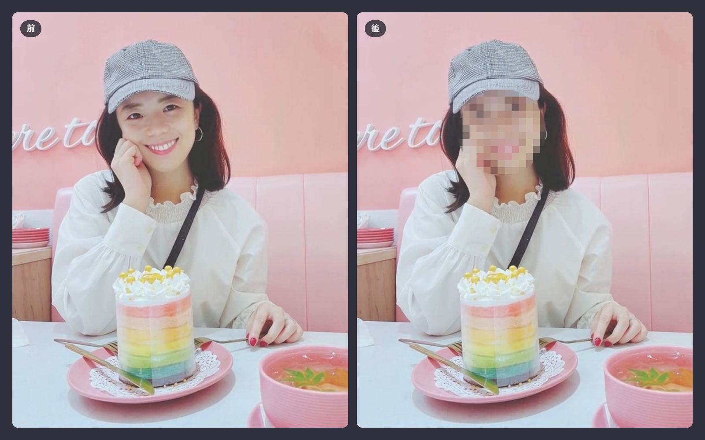
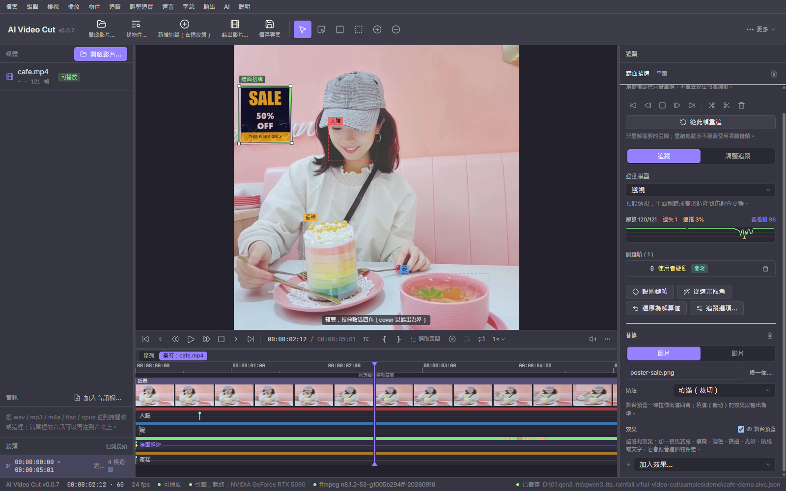

# AI Video Cut

**在影片裡選一個東西，它就會一路被追著跑——你可以幫它打馬賽克、換顏色、貼上文字，或整個換成別的畫面。**

免費使用，全部在你自己的電腦上跑，影片不會上傳到任何地方。

[English](README.en.md)



---

## 它可以幫你做什麼？

| 你想要… | 怎麼做 |
|---|---|
| 把影片裡路人的臉打上馬賽克 | 按「隱私打碼」，App 會自動找出所有人臉，勾掉不用打的，就完成了 |
| 遮掉車牌、商標、螢幕上的個資 | 打字「車牌」或「logo」，找到後套上馬賽克或模糊 |
| 把手機或電視螢幕換成另一段畫面 | 框出螢幕的四個角，選一張圖片或一段影片貼上去，會跟著鏡頭移動 |
| 讓某個東西變色、發光、加外框 | 選好物件後，在「效果」裡挑一種 |
| 在人或物體旁邊加一個跟著跑的文字或貼圖 | 效果選「文字」或「貼紙」，它會自動跟著物件走 |
| 把畫面裡不要的東西拿掉 | 用「移除物件」，App 會用影片其他時間拍到的背景補起來 |
| 橫的影片轉成手機直式 | 打一句「鏡頭跟著人」，裁切框會自動跟著人移動 |

## 截圖

| 打字找東西 | 物件與效果 |
|---|---|
|  |  |
| **隱私打碼（前後對照）** | **螢幕換畫面** |
|  |  |

## 三步驟上手

### 1. 選一個東西（三種方法，挑你順手的）

- **打字**：輸入「人臉」「車牌」「手機螢幕」，App 會把找到的全部列出來，你勾想要的就好。
- **用滑鼠點**：在畫面上點一下要的東西；選太多就按住 `Alt` 再點一下扣掉；也可以直接拖一個框。
- **叫 AI 幫你選**：說不清楚是哪一個時（例如「左邊那個人手上的杯子」），交給 Claude Code 或 Codex，它會自己看畫面、幫你選好。

### 2. 讓它自動追蹤

按「追蹤這個物件」，App 會一幀一幀跟著它，物件移動、轉身、被手擋住都沒關係。

如果中間某一段跟丟了，到那一幀再點一下修正，App 只會從那裡往後重算，前面已經對的部分不會動。

### 3. 套效果、輸出

在右邊的「效果」裡加上馬賽克、模糊、變色、外框、光暈、文字或貼紙，也可以疊好幾種。預覽沒問題就按「輸出」。

> **不會動到別的地方**：效果只改你選的那一塊，畫面其他部分會跟原本一模一樣。

## 其他功能

- **剪輯**：分割、刪片段、調順序、移除沒聲音的段落、加背景音樂、淡入淡出。
- **自動字幕**：在本機把說話轉成字幕，可以匯出字幕檔，或直接燒進影片。
- **AI 助手**：用一句話下指令，例如「把 2 到 4 秒剪掉」「幫臉打碼」「轉成直的」。它會先列出要做哪些步驟，你按了才會執行。
- **自動更新**：有新版本時會提醒你，一鍵更新。

## 安裝

到 [Releases](../../releases) 下載你電腦對應的安裝檔：

| 你的電腦 | 下載這個 | 說明 |
|---|---|---|
| Windows 10／11 | `*_x64-setup.exe` | 直接執行，不需要系統管理員權限 |
| Mac（M1 以後的機種） | `*_aarch64.dmg` | 拖進「應用程式」；第一次開啟若被擋，到「系統設定 → 隱私權與安全性」按「仍要打開」 |
| Linux | `*_amd64.deb` | `sudo apt install ./檔名.deb` |

**第一次開啟**會引導你下載 AI 引擎與模型，大約 6–7 GB，需要網路，請預留 15 GB 以上的硬碟空間。之後就可以完全離線使用。

### 電腦需要什麼？

- **Windows／Linux**：要有 NVIDIA 顯示卡，建議顯示記憶體 12 GB 以上，並把驅動程式更新到最新版。
- **Mac**：要 Apple 晶片（M1 以後），建議 16 GB 記憶體以上。不支援舊的 Intel Mac。
- 沒有合適的顯示卡就不能用：純 CPU 跑起來會慢到幾乎無法使用，所以 App 會直接告訴你，不會讓你空等。

## 常見問題

**影片會被上傳嗎？**
不會。所有處理都在你的電腦上完成；只有第一次下載模型、檢查更新時會連網。

**要付費嗎？**
不用，完全免費。

**「打字找東西」要打中文還是英文？**
常用的中文（人臉、車牌、螢幕、手…）App 會自動翻成英文。其他東西直接打英文通常比較準。

**畫面上說「改用 OWLv2 + SAM 2.1」是什麼意思？**
App 有兩套找東西的 AI。效果最好的 SAM 3 需要先到 [Hugging Face](https://huggingface.co/facebook/sam3) 申請使用權，並把 token 填進設定。沒有申請的話，App 會自動改用另一套免申請的，一樣能用，只是比較容易在鏡頭切換時跟丟。

**追蹤跟丟了怎麼辦？**
到跟丟的那一幀，用滑鼠補點一下，按「從這一幀往後重算」就好。

**我能把追蹤結果拿到其他軟體用嗎？**
可以。追蹤資料可以匯出成 JSON、CSV、PNG 遮罩，也能匯出給 After Effects、Nuke 用。格式說明在 [`docs/tracking-api.md`](docs/tracking-api.md)。

---

## 給開發者

### 命令列

App 裡的每個功能都有對應的指令，可以寫成腳本批次處理：

```powershell
$py = "$env:LOCALAPPDATA\net.markkulab.aivideocut\pyenv\Scripts\python.exe"
& $py -m aivc find   影片.mp4 --text "face" --out 結果\          # 打字找東西
& $py -m aivc fx     影片.mp4 --masks 結果\obj1\masks.aivm --effects '[{"type":"mosaic"}]' -o 打碼後.mp4
& $py -m aivc track-export 影片.mp4 --masks 結果\obj1\masks.aivm --format csv --out 臉的位置.csv
& $py -m aivc --help                                            # 全部指令
```

### 自己編譯

```powershell
.\scripts\bootstrap-engine.ps1   # 安裝 AI 引擎（Mac／Linux：sh scripts/bootstrap-engine.sh）
npm install
npm run tauri dev                # 開發模式啟動
npm run check                    # 跑全部檢查與測試
```

### 相關文件

- 架構：[`docs/architecture.md`](docs/architecture.md)
- 追蹤資料格式：[`docs/tracking-api.md`](docs/tracking-api.md)
- 自動更新與發版：[`docs/updater.md`](docs/updater.md)
- 外掛：核心以外的功能可以做成外掛，放在 `plugins/<名稱>/`。說明見架構文件。

### 用到的第三方元件

| 元件 | 用途 | 授權 |
|---|---|---|
| SAM 2.1、SAM 3（Meta） | 找東西、畫出輪廓、跟著追蹤 | Apache-2.0／SAM License |
| OWLv2（Google） | 用文字找東西 | Apache-2.0 |
| OpenCV | 平面追蹤、影像處理 | Apache-2.0 |
| PyTorch | 跑 AI 模型 | BSD-3 |
| faster-whisper | 語音轉字幕 | MIT |
| FFmpeg | 影片讀寫 | LGPL-3.0 |

## 授權

授權條款見 [`LICENSE`](LICENSE)，第三方元件授權見 [`THIRD-PARTY-NOTICES.txt`](THIRD-PARTY-NOTICES.txt)。
